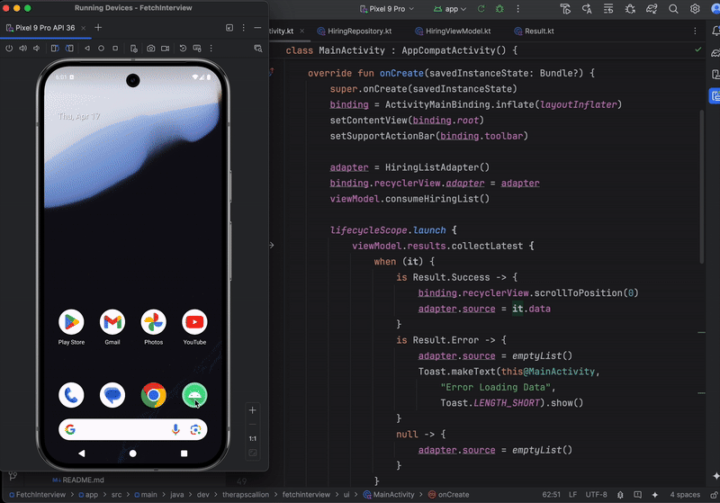

# FetchInterview
Interview Materials for Fetch

## Overview

This demo app is built using the **MVVM** architecture and leverages the following technologies:

- **Hilt** for dependency injection
- **Retrofit** for handling network requests
- **Room** for local data persistence and maintaining order
- **Coroutines** for managing asynchronous operations
- **Moshi** for JSON serialization and deserialization

## Areas for Improvement

While the core functionality is in place, there are a few areas that could be enhanced in future iterations:

- **Pagination**: The list currently loads all items at once. Adding paging using the would improve performance and scalability, especially for large data sets.
- **Git Files**: There's extra files in the git repo (such as DS_STORE) files that should be added to the ignore list
- **Tests**: While the app is setup with dependency injection, tests have not been made at this time.  

